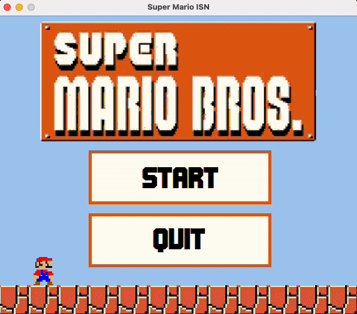

<!-- Improved compatibility of back to top link -->
<a id="readme-top"></a>

<!-- PROJECT SHIELDS -->
[![Build][build-shield]][build-url]
[![Release][release-shield]][release-url]
[![Contributors][contributors-shield]][contributors-url]
[![Forks][forks-shield]][forks-url]
[![Stargazers][stars-shield]][stars-url]
[![Issues][issues-shield]][issues-url]
[![License][license-shield]][license-url]

<!-- PROJECT LOGO -->
<br />
<div align="center">
  <a href="https://github.com/aymnms/mario-isn">
    
  </a>

<h3 align="center">Mario-ISN</h3>

  <p align="center">
    A Mario Bros game in C, ISN scientific project
    <br />
    <a href="https://github.com/aymnms/mario-isn"><strong>Explore the documentation »</strong></a>
    <br />
    <br />
    
    <br />
    <a href="https://github.com/aymnms/mario-isn/issues/new?labels=bug&template=bug-report---.md">Report a bug</a>
    &middot;
    <a href="https://github.com/aymnms/mario-isn/issues/new?labels=enhancement&template=feature-request---.md">Suggest a feature</a>
  </p>
</div>

<!-- TABLE OF CONTENTS -->
<details>
  <summary>Table of Contents</summary>
  <ol>
    <li><a href="#about-the-project">About the Project</a></li>
    <li><a href="#features">Features</a></li>
    <li>
      <a href="#getting-started">Getting Started</a>
      <ul>
        <li><a href="#prerequisites">Prerequisites</a></li>
        <li><a href="#installation">Installation</a></li>
        <li><a href="#commands">Commands</a></li>
        <li><a href="#download-a-release">Download a release</a></li>
      </ul>
    </li>
    <li><a href="#usage">Usage</a></li>
    <li><a href="#architecture">Architecture</a></li>
    <li><a href="#contributing">Contributing</a></li>
    <li><a href="#changelog">Changelog</a></li>
    <li><a href="#license">License</a></li>
    <li><a href="#acknowledgments">Acknowledgments</a></li>
  </ol>
</details>

<!-- ABOUT THE PROJECT -->
## About the Project

**Mario-ISN** is a project for the baccalauréat scientifique, specializing in ISN (Computer Science and Numerical Sciences).
The goal is to recreate a Mario Bros-type game in C language, using the SDL2 library.

The project received the **second prize of Labex Digicosme**:
🔗 [Read the article (french)](https://digicosme.cnrs.fr/concours-isn2018/)

Initially developed in 2017/2018 with 2 fellow students, the project has since been updated to SDL2 and given a modern,
fully automated build/release pipeline: every push to `main` is built, packaged and published for **four platforms**
without any manual step.

<p align="right">(<a href="#readme-top">back to top</a>)</p>

<!-- FEATURES -->
## Features

- **Cross-platform**: native builds for macOS (Apple Silicon and Intel, cross-compiled via Rosetta), Linux and Windows.
- **Self-contained releases**: SDL2/SDL2_image/SDL2_mixer are bundled into every artifact — no dependency to install on the target machine.
- **Automated releases**: [Conventional Commits](https://www.conventionalcommits.org/) drive [semantic-release](https://semantic-release.gitbook.io/), which bumps the version, generates the changelog and publishes the GitHub release with all four artifacts attached.
- **CI-verified on every branch**: the build matrix (macOS/Linux/Windows) runs on every push, not just on `main`.

<p align="right">(<a href="#readme-top">back to top</a>)</p>

<!-- GETTING STARTED -->
## Getting Started

Here are the steps to build and run the project locally.

### Prerequisites

- A C compiler (clang/gcc on macOS/Linux, MSVC on Windows)
- [CMake](https://cmake.org/) ≥ 3.20
- [Ninja](https://ninja-build.org/) (macOS/Linux)
- SDL2, SDL2_image, SDL2_mixer

### Installation

**macOS**

```sh
xcode-select --install                                 # Apple tools (clang, lldb…)
brew install cmake ninja pkg-config sdl2 sdl2_image sdl2_mixer
```

**Linux (Debian/Ubuntu)**

```sh
sudo apt-get install cmake ninja-build pkg-config \
  libsdl2-dev libsdl2-image-dev libsdl2-mixer-dev
```

**Windows**

Dependencies are resolved via [vcpkg](https://github.com/microsoft/vcpkg) — see [`.github/workflows/build.yml`](.github/workflows/build.yml) for the exact bootstrap/install commands used in CI, which you can reuse locally.

Then, from the repo root:

```sh
git clone https://github.com/aymnms/mario-isn.git
cd mario-isn
make run
```

### Commands

The [`Makefile`](Makefile) wraps the CMake configure/build steps. Run `make` with no target for the default (debug) build, or use one of:

| Command | Description |
|---|---|
| `make run` | Debug build, then launch the game |
| `make build` | Debug build only |
| `make prod-arm` | Release build for macOS (Apple Silicon) |
| `make prod-intel` | Release build for macOS (Intel), cross-compiled via Rosetta — see [Architecture](#architecture) |
| `make prod-linux` | Release build for Linux |
| `make clean` | Remove the build directory |

### Download a release

Prebuilt, self-contained binaries for macOS (Apple Silicon & Intel), Linux and Windows are published on the [**Releases**][release-url] page for every version — no need to install SDL2 yourself.

ℹ️ **Note for macOS**: the downloaded `.app` may be marked as coming from an unidentified source (`com.apple.quarantine`). Go to System Settings → Privacy & Security to "Open Anyway".

[![Game screenshot][product-screenshot-8]](#)

<p align="right">(<a href="#readme-top">back to top</a>)</p>

<!-- USAGE -->
## Usage

The game launches in windowed mode, with a main menu (the size of which cannot be changed).
Use the keyboard arrows to move the player, jump and interact with enemies.

| [![Game screenshot][product-screenshot-1]](#) | [![Game screenshot][product-screenshot-2]](#) | [![Game screenshot][product-screenshot-3]](#) |
|-----------------------------------------------|-----------------------------------------------|-----------------------------------------------|
| [![Game screenshot][product-screenshot-4]](#) | [![Game screenshot][product-screenshot-5]](#) | [![Game screenshot][product-screenshot-6]](#) |

<p align="right">(<a href="#readme-top">back to top</a>)</p>

<!-- ARCHITECTURE -->
## Architecture

```
mario-isn/
├── src/                  # Game source (C)
│   ├── main.c            # Entry point, SDL init, main loop
│   ├── display.c         # Rendering
│   ├── path.c            # Portable asset path resolution
│   ├── menu/              # Main menu
│   └── game/               # Gameplay: player, enemies, collisions, levels
├── include/              # Headers matching src/
├── ressources/           # Images, music, level files, macOS icon
├── cmake/                # CMake helper modules (macOS lib bundling)
├── scripts/              # Build/release helper scripts (Linux lib bundling, version bump)
├── CMakeLists.txt        # Build definition, per-OS packaging/bundling logic
├── Makefile              # Convenience wrapper around CMake
└── .github/workflows/    # CI build matrix + automated release pipeline
```

Assets and their platform-specific SDL2 libraries are bundled next to the executable at build time (`.app` bundle on
macOS, alongside the binary on Linux/Windows), so a downloaded release runs standalone.

<p align="right">(<a href="#readme-top">back to top</a>)</p>

<!-- CONTRIBUTING -->
## Contributing

Contributions, issues and feature requests are welcome. Commits follow [Conventional Commits](https://www.conventionalcommits.org/) —
this is what drives the automated versioning and changelog.

### Initial contributors

- Aymerick Michelet - [@aymnms](https://github.com/aymnms)
- Anthony Quéré - [@Anthony-Jhoiro](https://github.com/Anthony-Jhoiro)
- Léo LIRZIN

### And others... (or not 🥲)

<a href="https://github.com/aymnms/mario-isn/graphs/contributors">
  
</a>

<p align="right">(<a href="#readme-top">back to top</a>)</p>

<!-- CHANGELOG -->
## Changelog

The changelog is generated automatically from Conventional Commits — see [`CHANGELOG.md`](./CHANGELOG.md) or the [Releases][release-url] page.

<!-- LICENSE -->
## License

Distributed under the MIT License. See [`LICENSE`](LICENSE) for more information.

<p align="right">(<a href="#readme-top">back to top</a>)</p>

<!-- ACKNOWLEDGMENTS -->
## Acknowledgments

* The ISN teaching team
* Labex Digicosme
* [SDL2](https://www.libsdl.org/)

<p align="right">(<a href="#readme-top">back to top</a>)</p>

<!-- MARKDOWN LINKS & IMAGES -->
[build-shield]: https://img.shields.io/github/actions/workflow/status/aymnms/mario-isn/build.yml?branch=main&style=for-the-badge&label=build
[build-url]: https://github.com/aymnms/mario-isn/actions/workflows/build.yml
[release-shield]: https://img.shields.io/github/v/release/aymnms/mario-isn.svg?style=for-the-badge
[release-url]: https://github.com/aymnms/mario-isn/releases
[contributors-shield]: https://img.shields.io/github/contributors/aymnms/mario-isn.svg?style=for-the-badge
[contributors-url]: https://github.com/aymnms/mario-isn/graphs/contributors
[forks-shield]: https://img.shields.io/github/forks/aymnms/mario-isn.svg?style=for-the-badge
[forks-url]: https://github.com/aymnms/mario-isn/network/members
[stars-shield]: https://img.shields.io/github/stars/aymnms/mario-isn.svg?style=for-the-badge
[stars-url]: https://github.com/aymnms/mario-isn/stargazers
[issues-shield]: https://img.shields.io/github/issues/aymnms/mario-isn.svg?style=for-the-badge
[issues-url]: https://github.com/aymnms/mario-isn/issues
[license-shield]: https://img.shields.io/github/license/aymnms/mario-isn.svg?style=for-the-badge
[license-url]: https://github.com/aymnms/mario-isn/blob/main/LICENSE
[product-screenshot-1]: ressources/img/screenshot-1.png
[product-screenshot-2]: ressources/img/screenshot-2.png
[product-screenshot-3]: ressources/img/screenshot-3.png
[product-screenshot-4]: ressources/img/screenshot-4.png
[product-screenshot-5]: ressources/img/screenshot-5.png
[product-screenshot-6]: ressources/img/screenshot-6.png
[product-screenshot-7]: ressources/img/screenshot-7.gif
[product-screenshot-8]: ressources/img/screenshot-8.png
